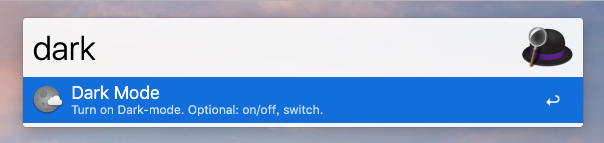
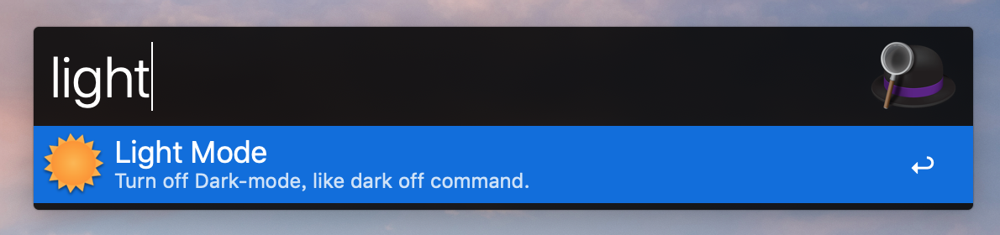

# Dark Mode Workflow

An alfred workflow for switch dark mode of macOS

## Install

1. You need install [dark-mode](https://github.com/sindresorhus/dark-mode) command.

    You can run follow command in terminal if [homebrew](http://brew.sh/) has installed on your mac:

    ```sh
    brew install dark-mode
    ```

2. Download and double-click `Dark Mode.alfredworkflow` file in [Release](https://github.com/m2nlight/DarkMode-workflow/releases) page, it will open Alfred workflow for install.

## Usage

- Input `dark` or `dark on` and enter to active dark-mode
- Input `light` or `dark off` and enter to active light-mode
- Input `dark switch` and enter to switch dark-mode




## Thanks

- The dark-mode cli from [@sindresorhus](https://github.com/sindresorhus)
- The icon from :link:[lanrentuku](http://www.lanrentuku.com/png/1522.html)
